## Project Title

Managing Security Operations with Microsoft Sentinel

## Objective

The aim of this project is to deploy Microsoft Sentinel in a log analytics workspace to leverage its SIEM and SOAR capabilities to manage security operations, ranging from collection of logs from various Azure services and resources to remediation of threat with playbooks.

## Tools Used

Microsoft Sentinel (Azure Portal), Microsoft Defender XDR Portal

## Lab Setup

* Deployment of Microsoft Sentinel in a log analytics workspace
* Configuration of the forwarding of Azure Bastion logs to the Sentinel Workspace via Diagnostic setting
* Enabling the ingestion of Azure Activity logs to the Sentinel workspace via Azure Activity connector
* Configuration of the collection and forwarding of Windows Security Events from virtual machines to the Sentinel workspace
* Development and implementation of analytics rules using Kusto Query Language queries to enhance threat detection capabilities.
* Implementation of SOAR workflows to support efficient remediation of security incidents.
  
## Architecture Diagram

## Preamble

This project builds upon a previously concluded project on Azure Firewall, and it focuses on the security operations aspect of the security solution, including logging, monitoring, threat detection and incident remediation. Where required, references will be made to the former project; however, all underlying concepts and configurations will be clearly explained to ensure completeness and clarity. 

## Steps Taken

The project commenced with the deployment of Microsoft Sentinel in the Project-workspace (this log analytics workspace was created in the last project and it already contains the Azure Firewall logs).  

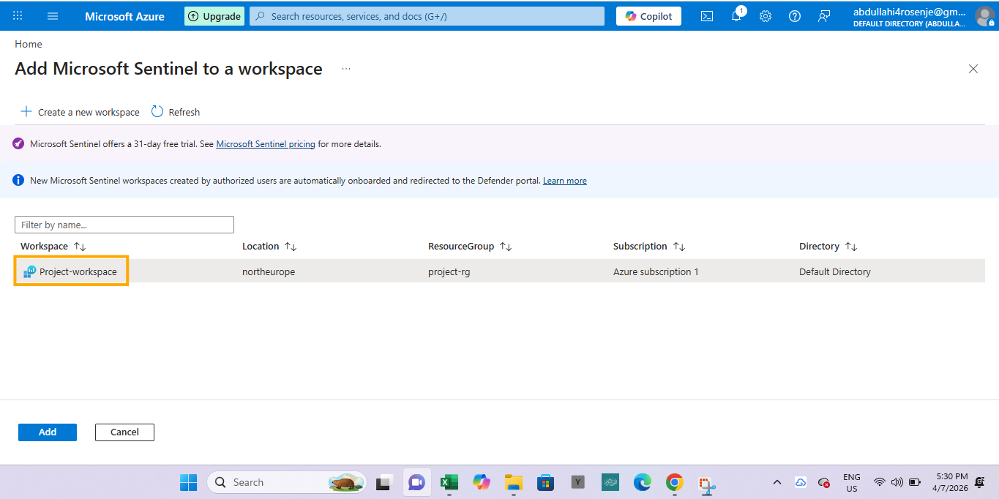

### Ingestion of Logs

Afterwards, Azure Bastion logs is forwarded to the Sentinel-integrated workspace via diagnostic settings (Project-BST-logs)

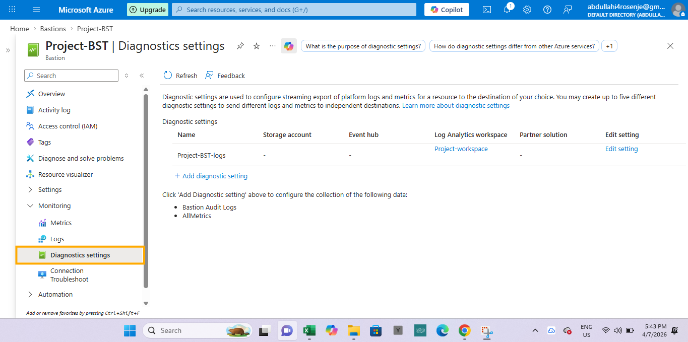

The Azure Bastion logs are stored in the MicrosoftAzureBastionAuditLogs table in the Sentinel-integrated workspace. It was confirmed that the workspace is now receiving logs from Azure Bastion.

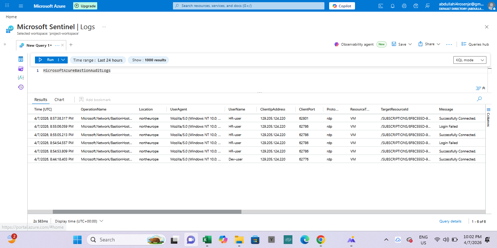

Additionally, Azure activity log which stores the event carried out in the Azure subscription including any updates made on the firewallis forwarded to the sentinel-integrated workspace via Azure Activity connector. The process started with the installation of Azure Activity from content hub and culminated with the configuration of the connector.

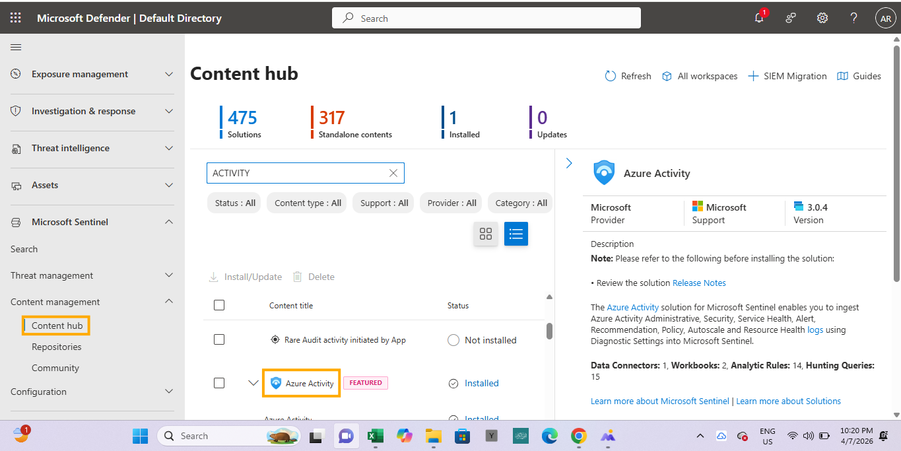

The Azure activity logs are now visible from the sentinel-integrated workspace as shown below.

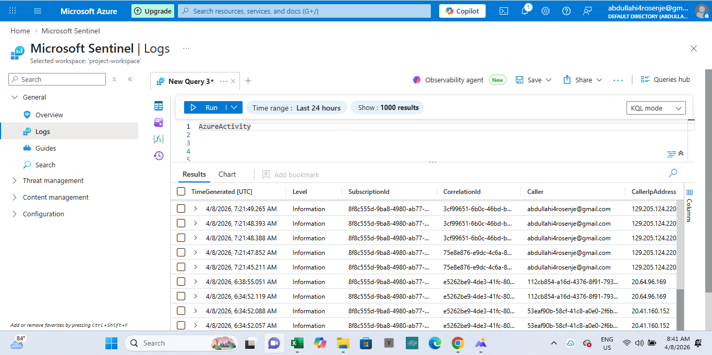

To ingest the logs from the virtual machines to the sentinel-integrated workspace, Window Security Event solution is installed from Content hub.

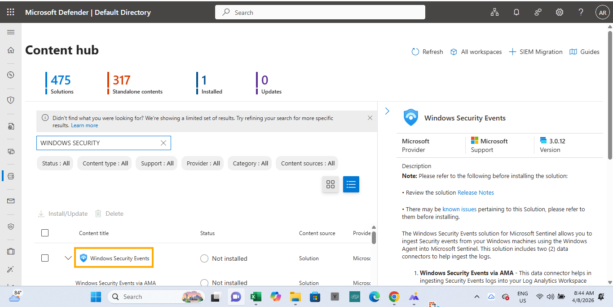

Then the Windows Security Event via Azure Monitor Agent (AMA), is configured through the connectors page.

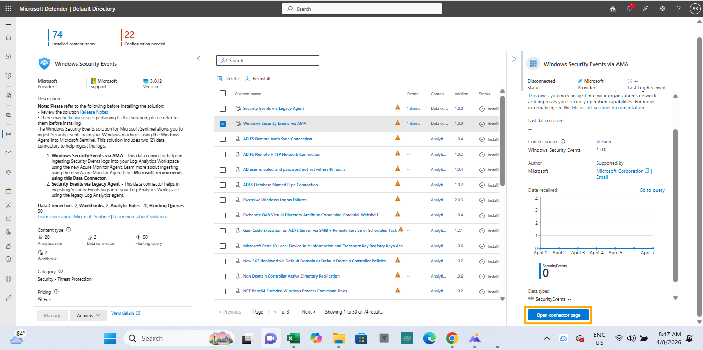

A significant step in the configuration of the connector is the creation of a data collection rule (DCR) 
this allows for the specyfing of the target resources (VMs) and the events to collect from it.

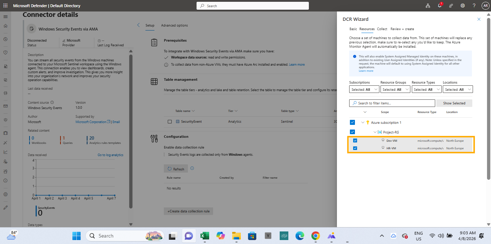

The completion of DCR automatically installs a AzureMonitorWindowsAgent extension on the VMs.

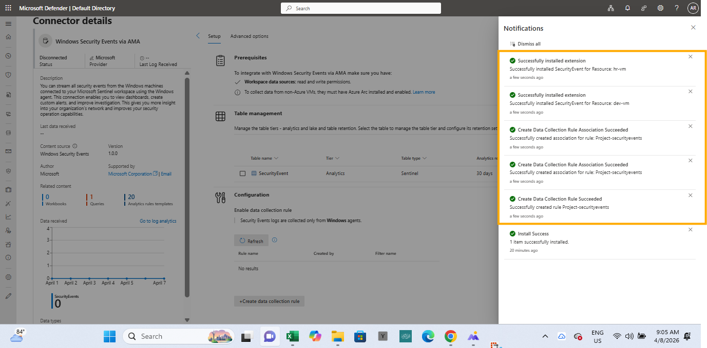

Note: If the DCR is created within the Microsoft Sentinel theWindows event log data will be stored in the SecurityEvent table, but if the DCR is created in the DCRs environment the event will be stored in the Event table without specialized security solution.

With the completion of the configuration of the connector, the staus of the connector now changes to connected, meaning, the agents are now installed on the target resources and are now ready to start collecting logs for fowarding to the Sentinel-integrated workspace. The images also features both the table management and DCR properties.

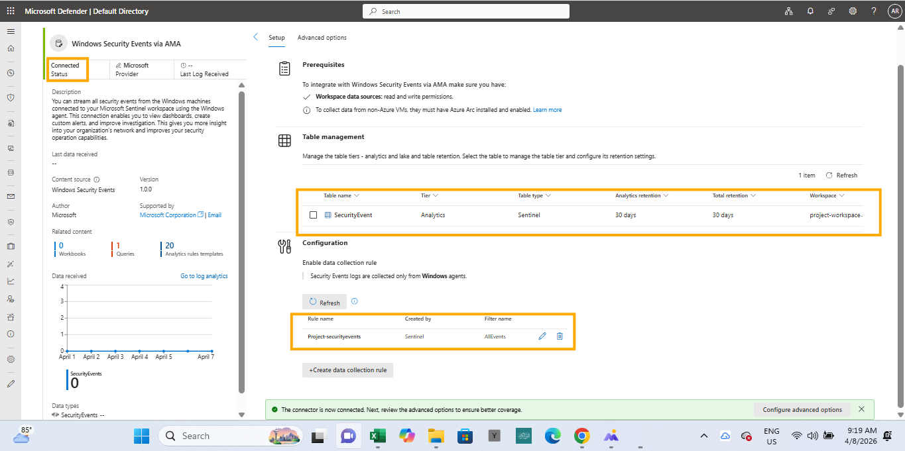

After the configuration was completed, I noticed the workspace wasn't receving logs despite the status of the connector showing connected. With my fervent troubleshoot, I realised the VMs are behind a firewall (In the last project the firewall was deployed to control the outbound traffic of the VMs, thus affecting the ability of the agent on the VMs to send logs to the Sentinel-integrated workspace). Allowing the firewall to grant access to the traffic requires understanding how traffic is routed from the agents to the workspace.
Typically, the traffic is routed from the VM to the Azure Monitor endpoint on the internet and the to the workspace. Hence, allow the traffic to pass we require granting access to Azure Monitor through the firewall policy.

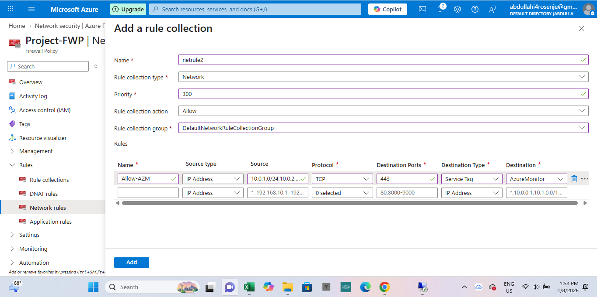

The network rule is use to grant the log traffic access to Azure Monitor by specifying it as a service tag.

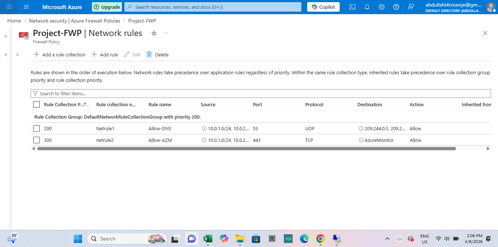

After the configuration, it is observed that the agent is now sending logs to the Sentinel-integrated workspace.

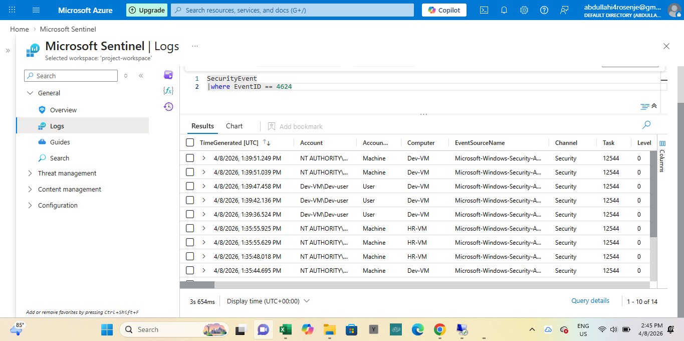

#### Detected Brute-Force attack

Aside check successful logins to the VMs, I also checked for failed logins to the VM, and something interesting played out. I detected a live brute-force attack. I could see multiple usernames in the range of hundreds being tried just within a few seconds. Apparently, the attack has been going on before I could gain access to the security event data of the VMs. This experience alone instilled the significance of monitoring with SIEM solutions. 

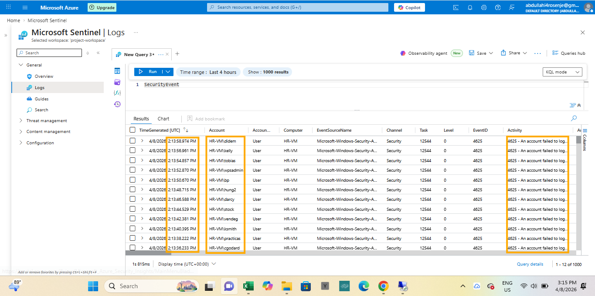

Sometimes, the language in which the username are written and some other unique features might provide a clue on the source of the attack or who the attacker is. 

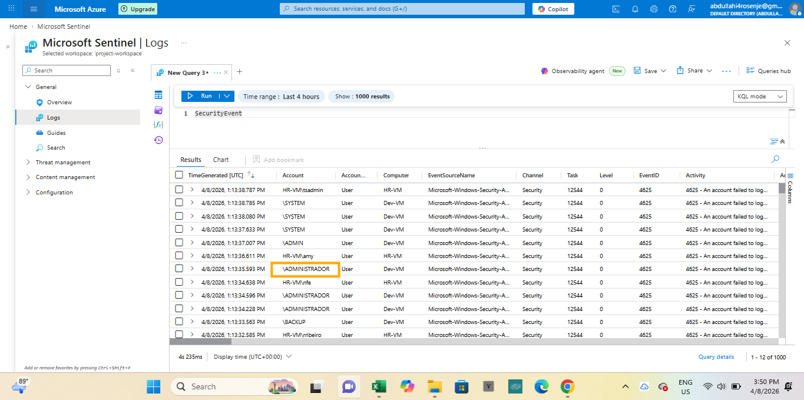

The brute force attack was due to the RDP port that was exposed to the internet, even though the traffic was routed through the firewall. From my analysis, the source IP of the attack is from the AzurFirewallSubnet, meaning the attacker connected to the firewall through its public IP because the DNAT rule allows connection from every source which then translate the connection to the affected VMs.  I earlier pointed it out in my last project that Azure Bastion is more secured compared to connecting to the VMs with direct RDP exposure. The attack was remediated by blocking the exposure of RDP to the internet.

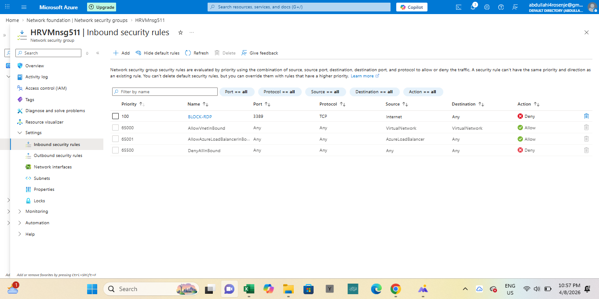

Another subtle way of preventing the attack is to allow only my local computer's public IP in the DNAT rule instead of any IP. This will prevent the attacker from connecting to the firewall while leaving the RDP port exposed to the internet.

### Creation of Analytics Rule

The following task is the creation of analytics rule to detect securrity threat from the various logs ingested into Sentinel-integrated workspace. First of all, a security threat was simulated and an analytics rule was created to detect it. Starting with Azure Bastion, another public IP was used to connect to the VM via Bastion. Then a KQL query was written to detect it. Afterwards, the query was used to create a rule which will fire an alert next time a different public IP is used other than the trusted IP.

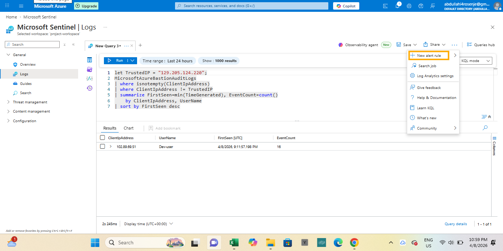

The type of alert rule created here is an scheduled rule, meaning the query runs at a specified interval to detect security threats. Here the name of the alert is specified among other steps. An essential part in the creation of the alert rule is the entity mapping which enriches the alert by adding further information about the details of alert, providing a clear context about the alert, at the same time making it easier to be remediated.

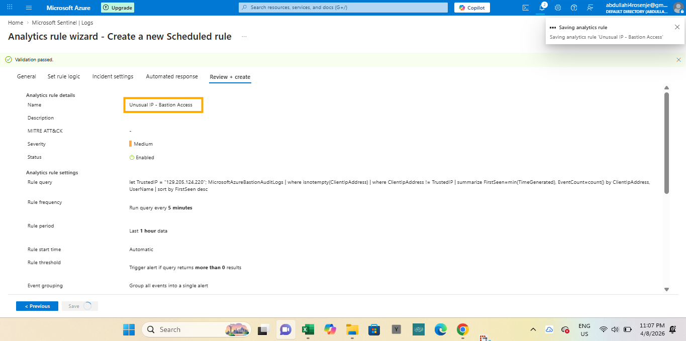

The rule is created to run automatically after it was created. Since the threat had already been simulated, the running of the query generates an alert.

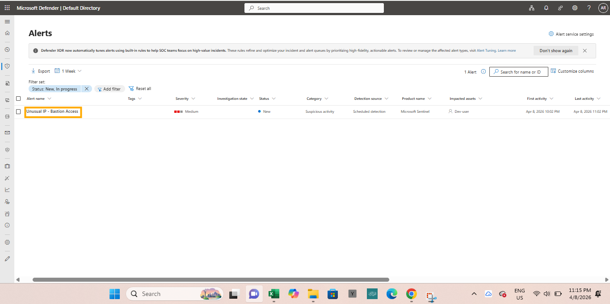

An analytics rule is also created for the rest of the other logs to detect security threats in those resources.

Firstly, the Azure activity, this registers any creation or updates on resources and services within the subscription. In this case, we want to use it to monitor the firewall policies, ensuring admins with access do not modify the policies unnoticed, thereby sabotging the security solution.  To simulate a security threat, the firewall policy was modified and the KQL query was used for the detection of the security threat.

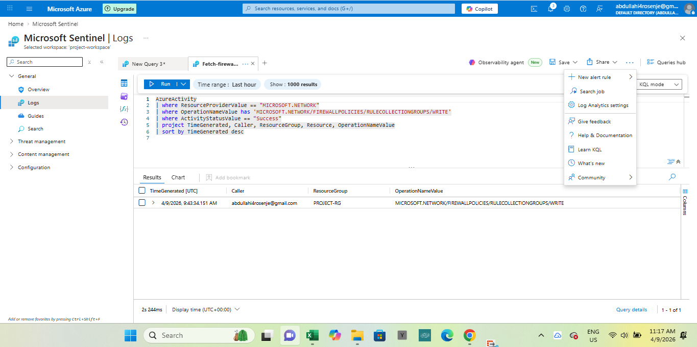

The creation of an alert rule from the query

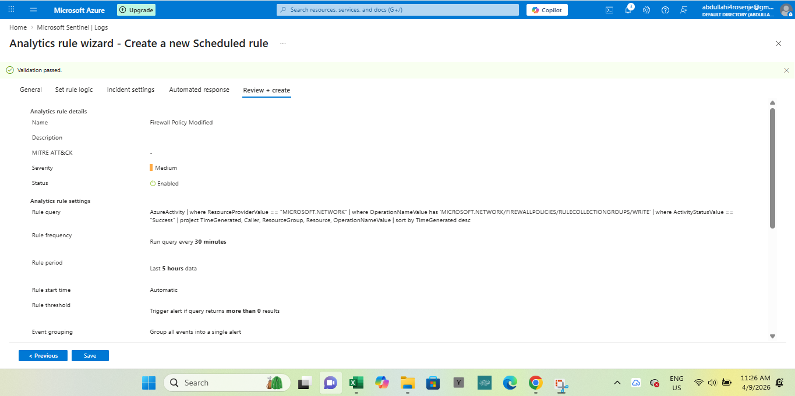

The generation of an alert with the rule

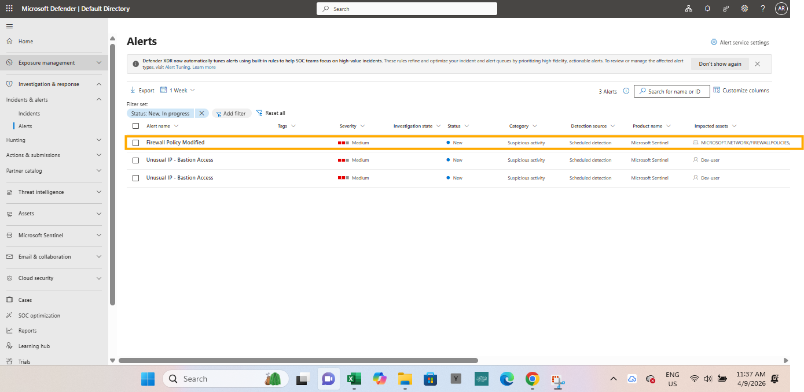

The next one is the firewall logs, particularly the application rule. The AZFWApplicationRule table contains the log data of the application rule and this was queried to gain context into the restricted web apps that users aim to connect to, which were of course denied. 

The first KQL for the detection was not that effective due to the inclusion of the domain of other background services.

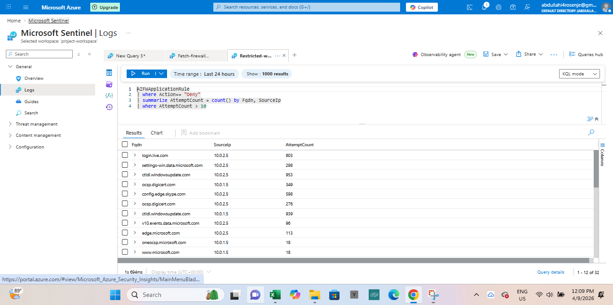

Afterwards, the query was optimized reducing false positives and removing noisy domains.

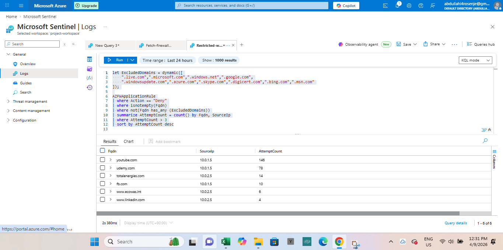

Followed with the creation of analytics rule

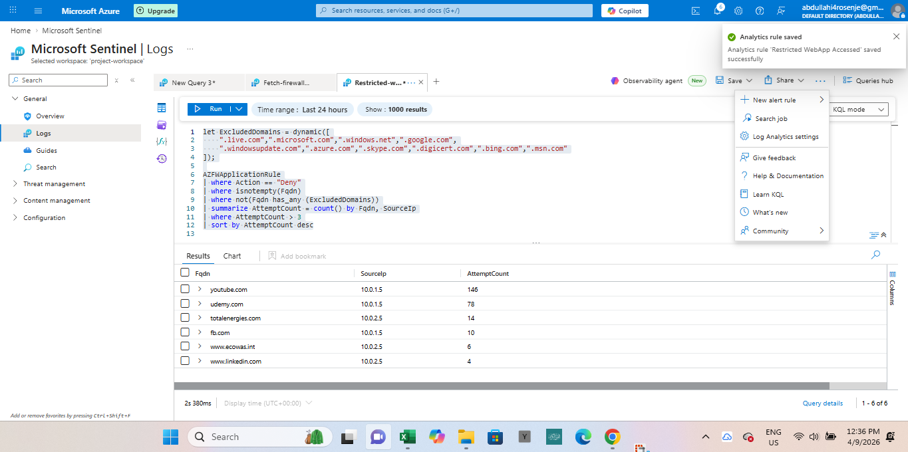

... and the generation of an alert with the analytics rule

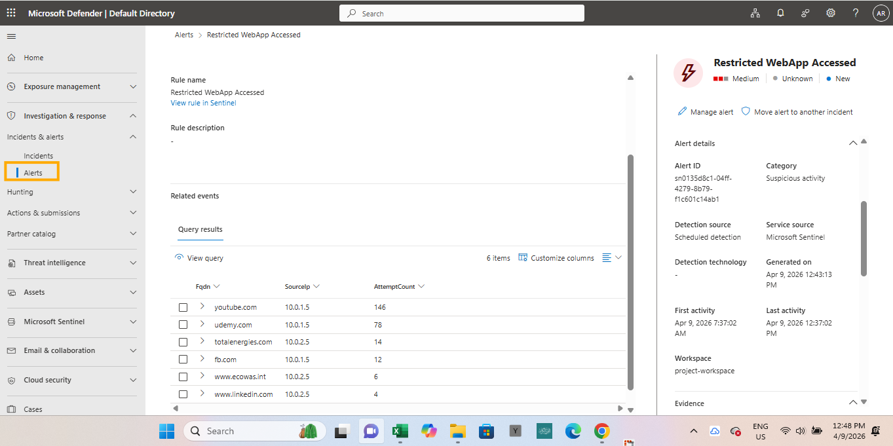

The last part is the creation of an analytics rule to detect security threats in the VMs. This started with the scenario of a user trying to access the VM and having tried multipled passwords, the user was able to gain access. This is important because it could either be that a legitmate user already forgot his password or unauthorized user is trying to gain access. This therefore requires a proper observation as quick as possible. The KQL query for the task is shown in the following image.

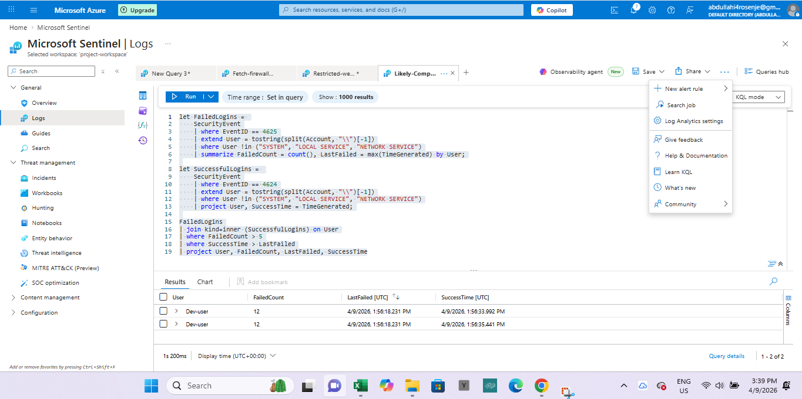

Then, the creation of analytics rule with the query.

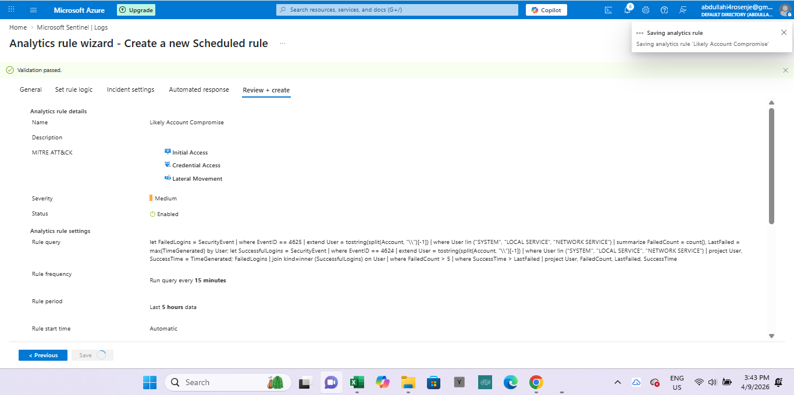

Having simulated the security threat, the analytics rule returns an alert after the rule creation was completed.

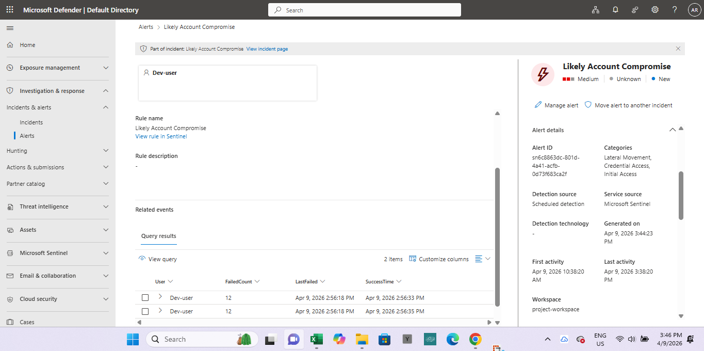

Note: There also inbuilt analytics rule
### Implementation of SOAR

## Conclusion

## Future Works

 
