## Project Title

Managing Security Operations with Microsoft Sentinel and Microsoft Defender

## Objective

The aim of this project is to deploy Microsoft Sentinel in a log analytics workspace to leverage its security information and event management (SIEM) and security orchestration and automation response (SOAR) capabilities to manage security operations, ranging from collection of logs from various Azure services and resources to remediation of threat with playbooks.

## Tools Used

Microsoft Sentinel (Azure Portal), Microsoft Defender Portal

## Lab Setup

* Deployment of Microsoft Sentinel in a log analytics workspace
* Configuration of the forwarding of Azure Bastion logs to the Sentinel Workspace via Diagnostic setting
* Enabling the ingestion of Azure Activity logs to the Sentinel workspace via Azure Activity connector
* Configuration of the collection and forwarding of Windows Security Events from virtual machines to the Sentinel workspace
* Development and implementation of analytics rules using Kusto Query Language queries to enhance threat detection capabilities.
* Implementation of SOAR workflows to support efficient remediation of security incidents.
  
## Architecture Diagram

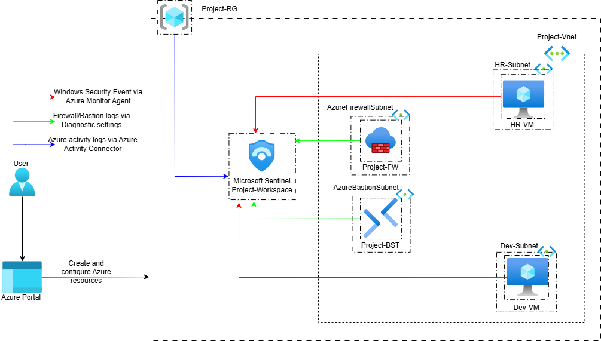

## Background Information

This project builds upon a previously concluded project on Azure Firewall, and it focuses on the security operations (SecOps) aspect of the security solution, including logging, monitoring, threat detection and incident remediation. Where required, references will be made to the former project; however, all underlying concepts and configurations will be clearly explained to ensure clarity. Azure firewall was deployed in the last project alongside other Azure services and resources (Azure Bastion, Virtual Machines, Log Analytics Workspace) to form a security solution. This project now aims to monitor the security solution to enhance its efficiency and resilience by ingesting logs from the Azure firewall, Azure Bastion, virtual machines (VMs) and the Azure subscription into a sentinel-integrated workspace to enable comprehensive security monitoring and effective threat detection across the environment. Logs from Azure Firewall will be used to monitor network traffic and web access to detect access to restricted or malicious websites. On the other hand logs from Azure Bastion will be used to monitor remote access activity to detect ununsual or unauthorized access. Azure activity will be used to monitor control plane actions to detect tampering with the configuration, for instance, modification of firewall policy, while VMs' logs will be used to monitor operating system and user-level events to detect brute-force and account compromise among other attacks.

## Steps Taken

The project was implemented in the following order.

### 1. Deployment of Microsoft Sentinel

The project commenced with the deployment of Microsoft Sentinel in Project-workspace (this log analytics workspace was created in the last project and it has already being configured to receive Azure Firewall logs) to have a Sentinel-integrated workspace 

### 2. Ingestion of Logs

Afterwards, Azure Bastion logs is forwarded to the Sentinel-integrated workspace via diagnostic settings (Project-BST-logs)

The Azure Bastion logs are stored in the MicrosoftAzureBastionAuditLogs table in the Sentinel-integrated workspace. It was confirmed that the workspace is now receiving logs from Azure Bastion.

Additionally, AzureActivity log which contains the activities carried out in the Azure subscription including any updates made on the firewall, is forwarded to the sentinel-integrated workspace via Azure Activity connector. The process started with the installation of Azure Activity connector from content hub and was rounded-off with the configuration of the connector.

The Azure activity logs are now visible from the sentinel-integrated workspace as shown below.

To ingest logs from the virtual machines to the sentinel-integrated workspace, Window Security Event solution is installed from Content hub.

Then the Windows Security Event via Azure Monitor Agent (AMA), is configured through the connectors page.

A significant step in the configuration of the connector is the creation of a data collection rule (DCR) 
this allows for the specyfing of the target resources (VMs) and the events to collect from it.

The completion of the creation of DCR automatically installs a AzureMonitorWindowsAgent extension on the VMs.

Note: If the DCR is created within the Microsoft Sentinel the Windows event log data will be stored in the SecurityEvent table, but if the DCR is created in the DCRs environment the event will be stored in the Event table without specialized security solution.

With the completion of the configuration of the connector, the staus of the connector now changes to connected, meaning, the agents are now installed on the target resources, and are now ready to start collecting logs for fowarding to the Sentinel-integrated workspace. The images also features both the table management and DCR properties.

After the configuration was completed, I noticed the workspace wasn't receving logs despite the status of the connector showing connected. With my fervent troubleshoot, I realised the VMs are behind a firewall (In the last project the firewall was deployed to control the outbound traffic of the VMs, thus affecting the ability of the agent on the VMs to send logs to the Sentinel-integrated workspace). Allowing the firewall to grant access to the traffic requires understanding how traffic is routed from the agents to the Sentinel-integrated workspace.
Typically, the traffic is routed from the VM to the Azure Monitor endpoint on the internet and then to the workspace. Therefore, granting the agents access to the Azure Monitor endpoint will resolve the issue.

The network rule is use to permit the agent's traffic to access to Azure Monitor by specifying Azure Monitor as a service tag in the rule.

After the configuration, it is observed that the agents on both VMs are now sending logs to the Sentinel-integrated workspace.

#### 2.1. Detected Brute-Force attack

Aside check successful logins to the VMs, I also checked for failed logins to the VM, and something interesting played out. I detected a live brute-force attack. I could see multiple usernames in the range of hundreds being tried just within a few seconds. Apparently, the attack has been going on before I could gain access to the security event data of the VMs. This experience alone instilled the significance of comprehensive visibility across the IT environment.

In some cases, the language used in the username and some other unique features might provide a clue on the source of the attack or the demographic profile of the attacker. 

The brute-force attack occurred due to the remote desktop protocol (RDP) port that was exposed to the internet, even though the traffic to the port was routed through the firewall. From my analysis, the source IP of the attacker is from the AzureFirewallSubnet address space. The attacker was able to attempt to connect to the VM through the firewall's public IP because the DNAT rule allows connection from any IP address but the connection was not successful. This makes Azure Bastion a prefferable option for secured remote connections to VMs compared to direct connection via RDP. Lastly, the attack was remediated by blocking the exposure of RDP port to the internet.

Another recommended way of preventing the attack is to restrict the source IPs to certain approved IP addresses instead of any IP address in the DNAT rule. This will prevent the attacker from establishing a connection to the VM through the firewall's public IP while the RDP port is still exposed to the internet.

### 3. Creation of Analytics Rule

The following task is the creation of analytics rule to detect securrity threat from the multiple logs ingested into the Sentinel-integrated workspace. First of all, a security threat was simulated and an analytics rule was created to detect it. Starting with Azure Bastion, another public IP was used to connect to the VM via Bastion, simulating a scenario whereby an unusual or anonymous IP is connecting to the VMs via Azure Bastion implying a security threat. Then a kusto query language (KQL) query was written to detect it. Afterwards, the query was used to create an analytics rule which will fire an alert next time a different public IP other than the trusted IP is used.

The type of alert rule created here is a scheduled rule, meaning the query runs at a specified interval to detect security threats. Here the name of the alert is specified (Unusual IP -Bastion Access) among other steps. An essential part in the creation of the alert rule is the entity mapping which enriches the alert by adding further information about the details of alert, providing a clear context about the alert to support its investigation, at the same time, making it easier to be remediated.

The rule is created to run automatically after it was created. Since the threat had already been simulated, the running of the query generates an alert.

An analytics rule is also created for the rest of the other logs to detect security threats in those resources.

The AzureActivity table records the creation or updates of resources and services within the subscription. In this case, monitoring the firewall policies, ensuring tampering with the configurations of the firewall policies do not go unnoticed, thereby preventing the sabotaging the security solution. To simulate a security threat, the firewall policy was modified and the KQL query was used for the detection of the security threat.

The creation of an analytics rule (Firewall Policy Modified) from the query

The generation of an alert with the analytics rule

The next one is the firewall logs, particularly the application rule. The AZFWApplicationRule table contains the log data of the application rule and this was queried to gain context into the restricted web apps that users aim to connect to, which were of course denied. 

The first KQL for the detection of the threat was not that effective due to the inclusion of the domains of other background services.

Afterwards, the query was optimized reducing false positives and removing noisy domains.

Followed with the creation of analytics rule (Restricted WebApp Accessed)

... and the generation of an alert with the analytics rule

The last part is the creation of an analytics rule to detect security threats in the VMs. This started with the simulation of a scenario whereby a user trying to access the VM has tried multiple incorrect passwords, before finally gaining access. This simulation is noteworthy because it could either be that a legitmate user already forgot his password or unauthorized user is trying to gain access with multiple tries. Hence, this kind of threat therefore requires a close observation as quick as possible. The KQL query for the threat detection is shown in the following image.

Then, the creation of analytics rule (Likely Account Compromise) with the query.

Having simulated the security threat, the analytics rule returns an alert after the rule creation was completed.

Note: There are also inbuilt analytics rule that comes with the data connectors, for instance Azure Activity data connector has 14 analytics rule which could be used to facilitate threat detection. These rules serving as a foundation could also be modified to suit your application. However, I decided to create my own rule from KQL queries because I needed to be sure that the rule can detect the simulated attack before going ahead with the creation of the analytics rule.

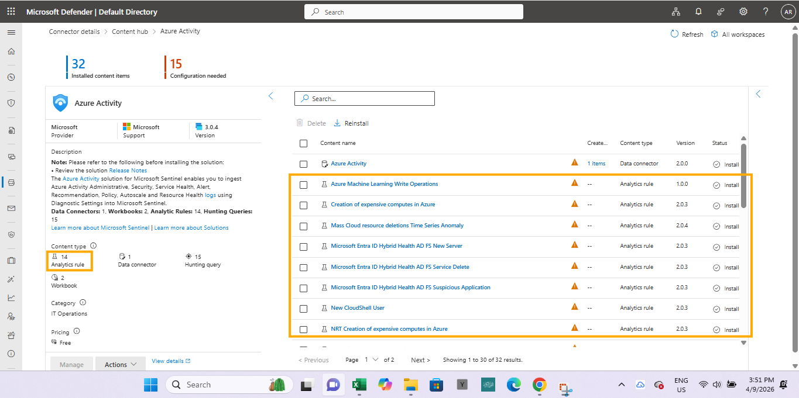

### 4. Implementation of SOAR
To facilitate the automatic remediation of the security alerts generated by the analytics rules the SOAR capabilities of Microsoft Sentinel was leveraged. Firstly, Sentinel SOAR essentials solution which contains various basic palybooks was installed from Content Hub. 

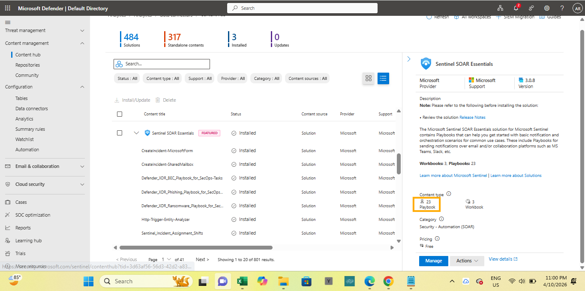

Afterwards, one of the playbook (Send-basic-email) was configured to send an email containing the incident details to the security team for a swift response once the alert is fired. In this case, the playbook will be configured to send the incident details as an email to a member of the security team when an unusaul Bastion access is detected.

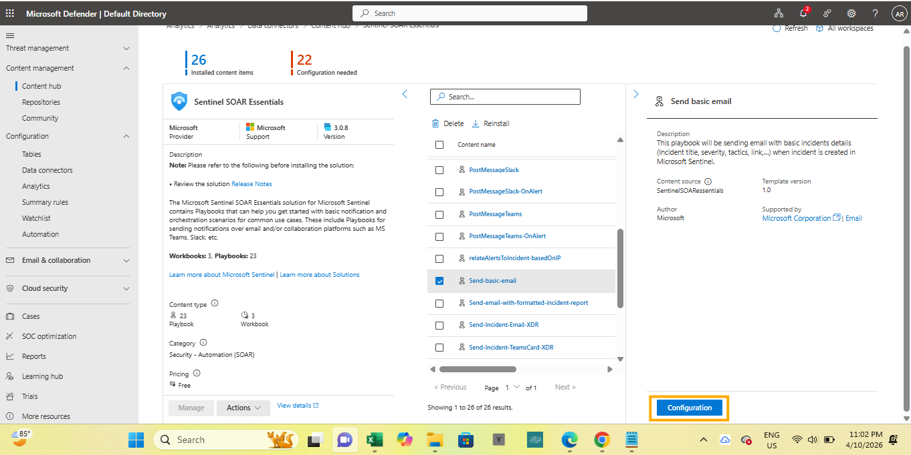

The completion of the configuration of the playbook adds it to the list of active playbooks. 

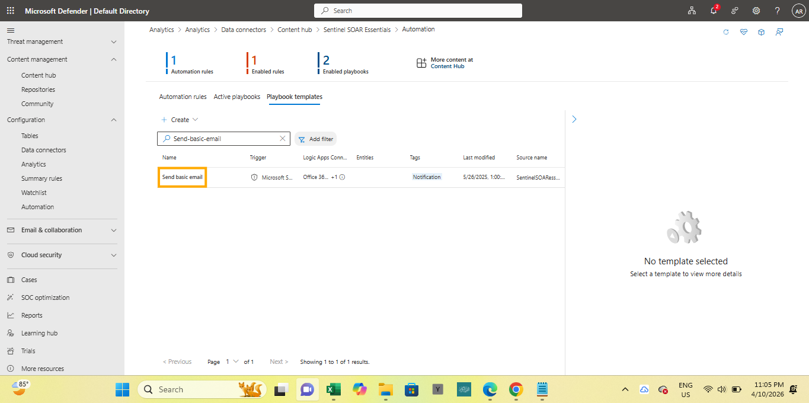

Afterwards, neccessary modification of the playbook was implemented in the logic app designer to suit its intended application.

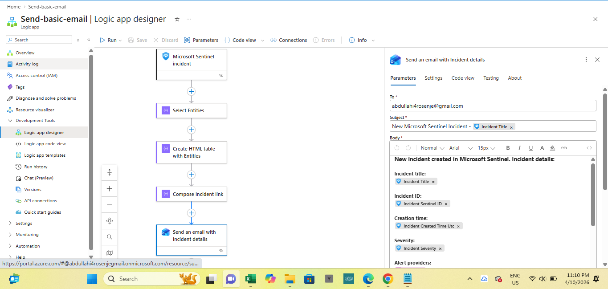

To ensure that the playbook is ran once the alert is generated, the analytics rule which generated the alert was modified. 

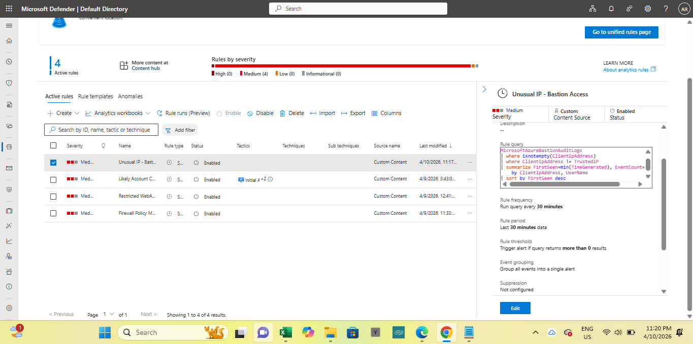

The modification is basically the addition of an automation rule to the automated response tab of the analytics rule. The playbook will be called in the automation rule, thus, the automation rule serve as a bridge between the analytics rule and the playbook.

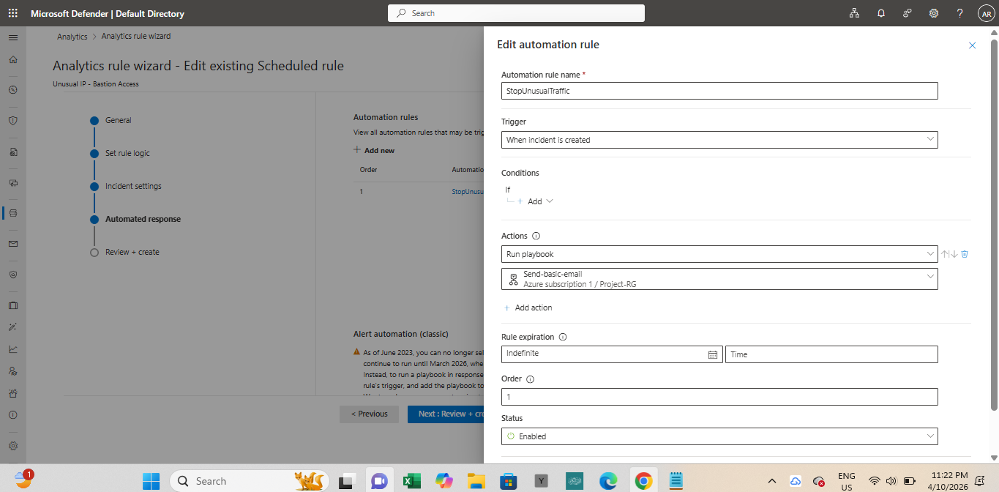

The completion of the modification of the analytics rule.

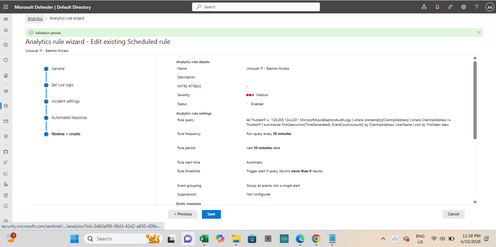

### 5. Testing of the SOAR

First of all, the security threat is simulated by connecting to the HR-VM via Azure Bastion with a public IP (the public IP was changed by connecting to a different internet service provider) different from the trusted IP. 

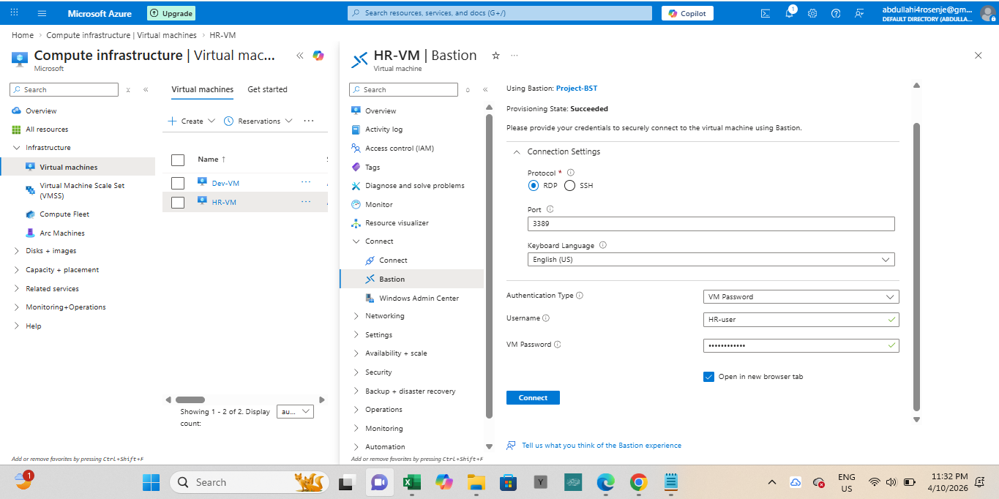

Afterwards, an alert was generated by the analytics rule (Unusual IP-Bastion Access)

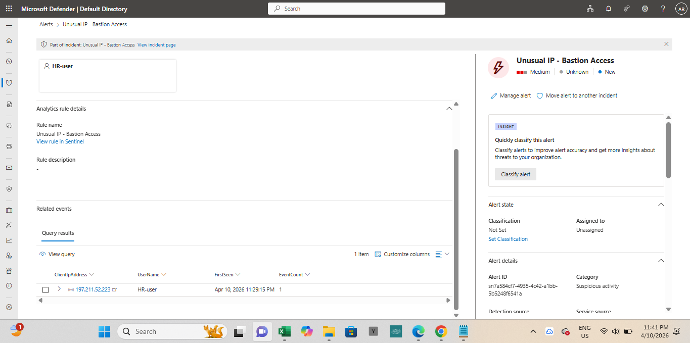

... and the playbook was triggered resulting in the sending of an email notification to a member of the security team for an urgent response.

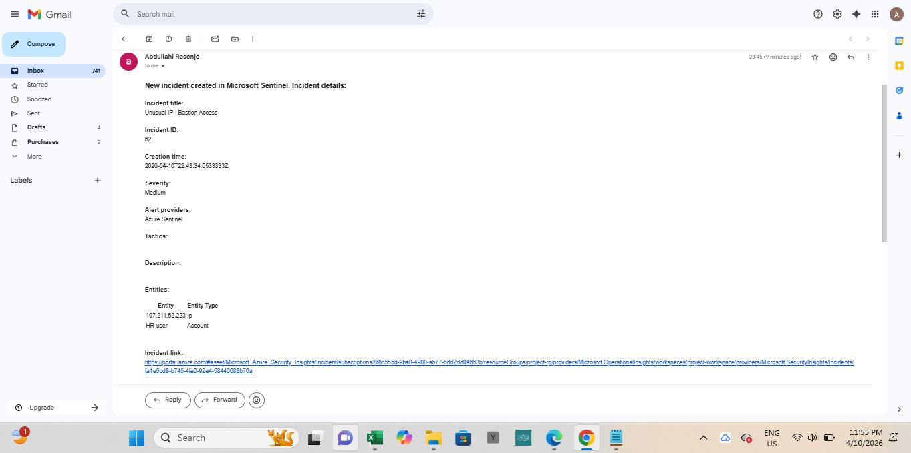

## Conclusion

This project highlights the significance of SIEM and SOAR solutions in not only securing devices but also monitoring the effectiveness and resilience of security solutions over time. It also underscores the relevance of log collection from 
multiple log sources to provide comprehensive visibility, enable cross-source correlation, detect diverse attack vectors, and support automated incident response, thereby enhancing the overall security posture of the environment.

## Future Works

Having explored some of the key areas of Microsoft Sentinel including log ingestion, KQL querying, analytics rule creation, incident investigation and automation using playbooks during this project, and being able to complete the tasks involved efficiently, it indicates my solid-level of familiarity and hands-on experience with Microsoft Sentinel as a tool for cybersecurity analysis. Going forward, additional projects will focus on deepening expertise in incident investigation and enhancing automation capabilities through the implementation of more advanced playbooks for security operation.

## Past Project

https://rhosinjay-cyb.github.io/Azure-Firewall/
